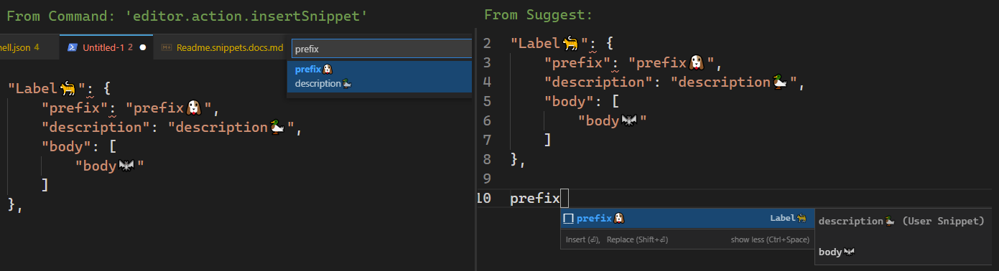

- [Dotfile snippets TOC](#dotfile-snippets-toc)
- [Whats new -- Predates 2023/06](#whats-new----predates-202306)
- [Snippets UI](#snippets-ui)
- [Scope: Global, Multi-language, or disabled](#scope-global-multi-language-or-disabled)
  - [Personal Scopes](#personal-scopes)
- [Keybinding a specific snippet](#keybinding-a-specific-snippet)
  - [Using an inline snippet](#using-an-inline-snippet)
  - [Keybind to a snippet definition](#keybind-to-a-snippet-definition)
- [Textmate Grammar](#textmate-grammar)
  - [Chars Escaped by `\`](#chars-escaped-by-)
  - [Grammar EBNF](#grammar-ebnf)
- [Tutorials, Docs, Cheatsheets](#tutorials-docs-cheatsheets)
  - [Docs](#docs)
  - [Reference](#reference)
- [Cheat Sheet: Dates](#cheat-sheet-dates)


# Dotfile snippets TOC

populated: 2023-09-22

**snippets TOC index**

- [extension](file:///C:\Users\cppmo_000\.vscode\extensions\ms-vscode.powershell-2023.9.2\snippets\PowerShell.json)
- [Readme TOC \( this file \)](./Readme.snippets.docs.md)

**powershell**

- [./pwsh-2023-06.code-snippets](./pwsh-2023-06.code-snippets)
- [./pwsh ⇢ TypeWriter ⇢ NewFile Template.code-snippets](./pwsh%20⇢%20TypeWriter%20⇢%20NewFile%20Template.code-snippets)
- [./powershell.json](./powershell.json)
- [./Pester5UnitTest.code-snippets](./Pester5UnitTest.code-snippets)
- [./pester.code-snippets](./pester.code-snippets)
       
**other primary ones**

- [./powerquery.json](./powerquery.json)
- [./markdown.json](./markdown.json)
       
**the rest**

- [./sql.json](./sql.json)
- [./global-2023-06.code-snippets](./global-2023-06.code-snippets)
- [./javascript_and_typescript.code-snippets](./javascript_and_typescript.code-snippets)
- [./escape_text.code-snippets](./escape_text.code-snippets)
- [./everything.code-snippets](./everything.code-snippets)
       
**minimal to none**

- [./json_and_jsonc.code-snippets](./json_and_jsonc.code-snippets)
- [./csharp.json](./csharp.json)
      
**oldest**

- [./last.powershell.json](./last.powershell.json)
- [./templates.json.code-snippets](./templates.json.code-snippets)


# Whats new -- Predates 2023/06

- [There is a new command Transform to Snake Case](https://code.visualstudio.com/updates/v1_53#_transform-to-snake-case) that will convert the selected text to snake case
- new command `transform_snake_to_camel`
-  add `RELATIVE_FILEPATH` snippet variable PR #114208
-  `RANDOM_UUID` snippet variable PR #113826
-  [snippet variables](https://code.visualstudio.com/updates/v1_53#_new-snippet-variables)
-  [inline provider API](https://code.visualstudio.com/updates/v1_54#_inline-value-provider-api)
- ["Implement a "toggle this item in some way"](https://code.visualstudio.com/updates/v1_63#_quick-pick-api-improvements) such as an "Insert Snippet" command."
- [Addon arrow functions](https://marketplace.visualstudio.com/items?itemName=deinsoftware.arrow-function-snippets)
- [detailed completion item labels](https://code.visualstudio.com/updates/v1_58#_detailed-completion-item-labels) this would be neat, to highlight my functions without 'corrupting' the names

snake/camel/pascal?
```json
"${TM_FILENAME/(.*)/${1:/upcase}/}"
```

# Snippets UI



# Scope: Global, Multi-language, or disabled

 | Scope           | .                                             |
 | --------------- | --------------------------------------------- |
 | global:         | Either empty or undeclared                    |
 | multi-language: | `"scope": "json,jsonc"`                       |
 | Disabled:       | `"scope":"off"` ( any unused or invalid name) |

 ## Personal Scopes

 | Scope                   | .                                                                 |
 | ----------------------- | ----------------------------------------------------------------- |
 | `template` or `example` | These are not used themselves, but are examples for new snippets. |
 | `wip`                   | May not be finished                                               |


# Keybinding a specific snippet

- <https://code.visualstudio.com/docs/editor/userdefinedsnippets#_assign-keybindings-to-snippets> 
- <https://code.visualstudio.com/docs/editor/userdefinedsnippets#_snippet-syntax>
- <https://code.visualstudio.com/api/language-extensions/snippet-guide#using-textmate-snippets>

## Using an inline snippet

```json
{
  "key": "cmd+k 1",
  "command": "editor.action.insertSnippet",
  "when": "editorTextFocus",
  "args": {
    "snippet": "console.log($1)$0"
  }
}
```

## Keybind to a snippet definition

```json
{
  "key": "cmd+k 1",
  "command": "editor.action.insertSnippet",
  "when": "editorTextFocus",
  "args": {
    "langId": "csharp", // lang filename
    "name": "myFavSnippet"
  }
}
```

# Textmate Grammar

[TextMate Grammar](https://macromates.com/manual/en/snippets)

## Chars Escaped by `\`

- `\` escapes `$`, `}`, `\` 
- inside `choice`, it escapes `,` and `|`

## Grammar EBNF

```
any         ::= tabstop | placeholder | choice | variable | text
tabstop     ::= '$' int
                | '${' int '}'
                | '${' int  transform '}'
placeholder ::= '${' int ':' any '}'
choice      ::= '${' int '|' text (',' text)* '|}'
variable    ::= '$' var | '${' var '}'
                | '${' var ':' any '}'
                | '${' var transform '}'
transform   ::= '/' regex '/' (format | text)+ '/' options
format      ::= '$' int | '${' int '}'
                | '${' int ':' '/upcase' | '/downcase' | '/capitalize' | '/camelcase' | '/pascalcase' '}'
                | '${' int ':+' if '}'
                | '${' int ':?' if ':' else '}'
                | '${' int ':-' else '}' | '${' int ':' else '}'
regex       ::= JavaScript Regular Expression value (ctor-string)
options     ::= JavaScript Regular Expression option (ctor-options)
var         ::= [_a-zA-Z] [_a-zA-Z0-9]*
int         ::= [0-9]+
text        ::= .*
```


# Tutorials, Docs, Cheatsheets

## Docs

docs:
    https://code.visualstudio.com/docs/editor/userdefinedsnippets

regex transform:
    https://code.visualstudio.com/docs/editor/userdefinedsnippets#_transform-examples

extension snippets tutorial:
    https://code.visualstudio.com/api/language-extensions/snippet-guide

## Reference

vscode variables:
    https://code.visualstudio.com/docs/editor/userdefinedsnippets#_variables


# Cheat Sheet: Dates

For the date `2021-07-11`

```sh
$CURRENT_YEAR             = '2021'
$CURRENT_YEAR_SHORT       = '21'
$CURRENT_MONTH            = '07'
$CURRENT_MONTH_NAME       = 'July'
$CURRENT_MONTH_NAME_SHORT = 'Jul'
$CURRENT_DATE             = '11'
$CURRENT_DAY_NAME         = 'Sunday'
$CURRENT_DAY_NAME_SHORT   = 'Sun'
$CURRENT_HOUR             = '08'
$CURRENT_MINUTE           = '06'
$CURRENT_SECOND           = '14'
$CURRENT_SECONDS_UNIX     = '1626008774'
```